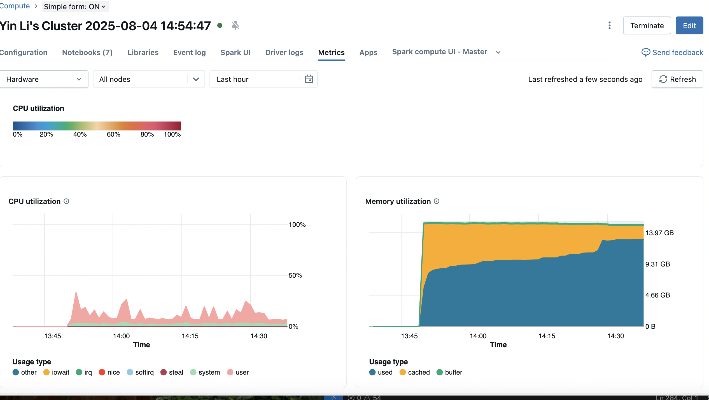

# Databricks VIC Traffic

<!-- TODO: Add traffic_dashboard.png image file to display the Traffic Flow Dashboard -->
<!--  -->

Databricks VIC Traffic transforms Victorian Department of Transport feeds into trusted, analytics-ready insights. It gives business leaders near-real-time visibility into congestion, incidents, and network performance while enforcing enterprise-grade governance through Databricks Unity Catalog.

## Executive Overview

- Accelerates decision-making with curated traffic intelligence that was previously spread across siloed systems.
- Delivers a governed, scalable data foundation ready for dashboards, predictive analytics, and partner reporting.
- Automates ingestion and quality checks, reducing manual effort for analysts and operations teams.
- Designed to meet enterprise security and compliance standards using Delta Lake and Unity Catalog.

## Business Outcomes

- **Faster insights:** Shrinks data preparation time from days to hours by automating data landing, cleansing, and aggregation.
- **Improved service delivery:** Provides timely congestion and incident metrics to inform transport planning and public communications.
- **Operational efficiency:** Standardised pipelines minimise manual data wrangling, freeing teams for higher-value analysis.
- **Scalable governance:** Centralised access controls and auditability support compliance and partnership reporting.

## Key Capabilities for Stakeholders

- **Unify disparate feeds:** Consolidates telemetry, incidents, and metadata into a single source of truth.
- **Curated analytics layers:** Bronze, Silver, and Gold tables deliver the right level of detail for different audiences.
- **Enterprise governance:** Unity Catalog ensures consistent permissions, lineage, and audit trails.
- **Automation ready:** CI/CD assets accelerate deployment, secret rotation, and scheduled refreshes across environments.

## Stakeholders & Consumers

- **Executive Leadership:** Visibility into network performance, congestion hotspots, and investment impact.
- **Transport Operations:** Near-real-time insights for incident response and traffic management.
- **Analytics & Planning Teams:** Reliable dataset foundation for forecasting and scenario modelling.
- **External Reporting:** Shareable gold-layer tables that power dashboards and partner scorecards.

## Status & Next Milestones

- **Current state:** Core ingestion and transformation notebooks complete; CI/CD assets available for automation.
- **In progress:** Operationalising scheduled runs and finalising Unity Catalog permissions for production rollout.
- **Next opportunities:** Embed predictive models for demand forecasting, expand data sources (weather, events), and publish executive dashboards.

## Risk & Mitigation Snapshot

- **Data completeness:** Monitor source feed availability; bronze layer keeps history for replay.
- **Access control:** Unity Catalog enforces least-privilege; review quarterly.
- **Operational resilience:** Jobs can be scheduled with retries and alerting via Databricks Workflows.

## Call to Action

- Approve production deployment resources (workspace, compute, service principal).
- Align on dashboard requirements for Gold layer consumers.
- Identify additional datasets or KPIs desired for the next release.

---

## Technical Appendix

The sections below provide implementation guidance for engineering and data platform teams.

### TL;DR for Technical Teams
- Automates ingestion of raw VIC traffic feeds into Bronze, Silver, and Gold Delta tables.
- Leverages Databricks Unity Catalog for secure data governance.
- Provides notebooks for configuration, ETL orchestration, and incremental table maintenance.
- Includes CI/CD workflows and scripts for deploying jobs and managing secrets.

### Project Structure

```
databricks_vic_traffic/
├── notebooks/
│   ├── 1_config.ipynb             # Environment & catalog configuration
│   ├── 2_setup.ipynb              # Source setup & schema registration
│   ├── 3_clearup_old_tables.ipynb # Cleanup utilities for stale objects
│   ├── 4_bronze_loader.ipynb      # Raw ingestion into Bronze tables
│   ├── 5_silver_loader.ipynb      # Transformations into curated Silver tables
│   ├── 6_gold_loader.ipynb        # Aggregations & Gold-level marts
│   └── playground.ipynb           # Scratchpad for exploratory analysis
└── CICD/
    ├── cicd-main.yml.ipynb        # GitHub Actions template for pipeline runs
    ├── deploy.yml.ipynb           # Deployment workflow (jobs/workspaces)
    └── shellScript/
        └── DBToken.ps1.ipynb      # Helper script for managing PAT/DB tokens
```

### Medallion Architecture Overview

- **Bronze Layer** (`4_bronze_loader.ipynb`)
  - Land raw traffic telemetry and metadata as Delta tables.
  - Handles schema drift and ensures reproducibility with checkpoints.

- **Silver Layer** (`5_silver_loader.ipynb`)
  - Cleanses and standardises raw data (e.g., column typing, deduplication).
  - Applies business logic for traffic sensors, incidents, and congestion metrics.

- **Gold Layer** (`6_gold_loader.ipynb`)
  - Produces analytics-friendly aggregates for reporting dashboards.
  - Supports downstream consumption via Unity Catalog tables or Databricks SQL.

### Getting Started

1. **Clone the repository**
   ```bash
   git clone https://github.com/yinli113/databricks_vic_traffic.git
   cd databricks_vic_traffic
   ```

2. **Import notebooks into Databricks**
   - Use the Databricks UI or `databricks workspace import_dir` CLI command.
   - Ensure the target workspace has Unity Catalog enabled.

3. **Set up configuration**
   - Open `notebooks/1_config.ipynb` and configure:
     - Catalog & schema names
     - Data storage locations (e.g., ADLS Gen2, S3)
     - Secrets scope for credentials (e.g., API keys, storage tokens)

4. **Run ETL notebooks in order**
   1. `1_config.ipynb`
   2. `2_setup.ipynb`
   3. `4_bronze_loader.ipynb`
   4. `5_silver_loader.ipynb`
   5. `6_gold_loader.ipynb`
   - Execute `3_clearup_old_tables.ipynb` as needed to remove legacy tables prior to reruns.

### CI/CD Automation

- `CICD/cicd-main.yml.ipynb`: Reference pipeline that demonstrates GitHub Actions orchestration for linting, testing, and Databricks job submission.
- `CICD/deploy.yml.ipynb`: Workflow for packaging notebooks and deploying to target workspaces via the Databricks REST API.
- `CICD/shellScript/DBToken.ps1.ipynb`: PowerShell helper to generate Databricks PATs and store them as GitHub secrets.

You can export these `.ipynb` files as YAML or scripts to integrate with your automation environment. Replace placeholder secrets (`DATABRICKS_HOST`, `DATABRICKS_TOKEN`, etc.) before running the workflow.

### Data Sources & Governance

- Source data: Victorian Department of Transport traffic datasets (update configuration to point to the raw feed location).
- Unity Catalog is used for access control, auditing, and lineage.
- Ensure proper ACLs for service principals running automated jobs.

### Observability & Maintenance

- Consider enabling auto-logging via Databricks Jobs or MLflow for monitoring run status.
- Leverage Delta table history (`DESCRIBE HISTORY`) to audit changes.
- Schedule Bronze/Silver notebooks as Jobs for continuous ingestion; trigger Gold aggregations on demand or via workflow dependencies.

### Roadmap Ideas

- Add unit tests with `pytest`/`dbx` for transformation logic.
- Parameterise notebooks for environment-specific runs.
- Integrate Delta Live Tables or Databricks Workflows for managed orchestration.
- Publish dashboard artifacts (e.g., Power BI, Tableau) consuming Gold tables.

### Roadmap Tracking

- Maintain the executive-facing roadmap bullets in this README and update them as priorities shift.
- Create GitHub issues for each roadmap item, tagged with labels such as `roadmap` or `phase-1`, and assign owners plus target dates.
- Add those issues to a GitHub Project board (Kanban or timeline) to visualise `Planned → In Progress → Done` and manage dependencies.
- Group related work under GitHub milestones (e.g., "Production Launch") so progress and due dates stay visible to stakeholders.
- Link documentation, dashboards, or notebooks back to the relevant issue for single-source traceability.

### PR Summary Template

Use the snippet below when opening pull requests for README or documentation updates:

```
## Summary
- <High-level change, e.g., "Refine README with executive overview and technical appendix">
- <Key value delivered to stakeholders>

## Testing
- Documentation-only change (no automated tests)
```

For code-focused PRs, extend the template with sections for regression testing, data validation, or deployment considerations as needed.

### License

This project is licensed under the MIT License. See `LICENSE` for details.